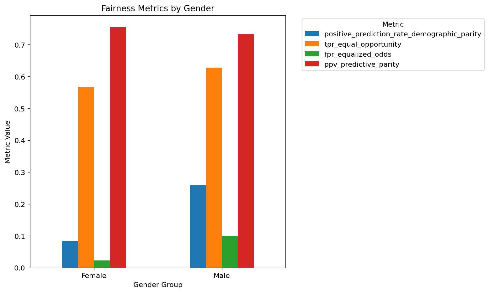
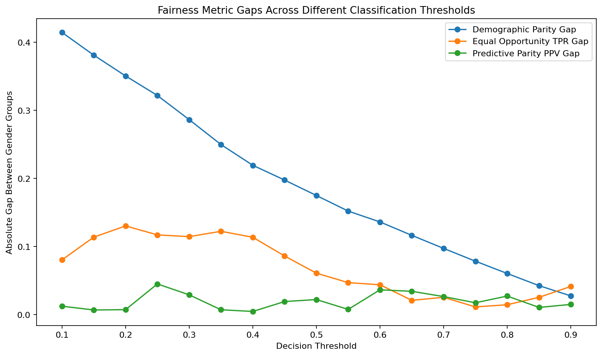

# Auditing Income Prediction Models for Gender Bias in Employment Decisions

A reproducible fairness audit of a logistic regression model trained on the UCI Adult dataset. The project combines income prediction, subgroup evaluation, SHAP and LIME explanations, hypothetical recourse, and responsible AI governance analysis.

**Main finding:** the model reaches **85.49% accuracy** and **0.9093 ROC AUC**, while predicting income above $50K for **8.53% of Female records** and **26.02% of Male records**. Similar precision across groups does not imply similar access to positive predictions.

The analysis uses the dataset's recorded `sex` categories. The title refers to the broader gender fairness question; the dataset itself does not measure gender identity. Employment decisions are a motivating scenario. The model predicts historical income, which is not a validated measure of job qualification or future performance.

## Problem

An income model can reproduce unequal historical outcomes even when its aggregate accuracy looks strong. If income predictions were repurposed to screen or rank applicants, those patterns could influence access to opportunity. This project asks:

- How do positive prediction rates and error rates differ across recorded sex groups?
- Do demographic parity, equal opportunity, equalized odds, and predictive parity tell the same story?
- Which features influence predictions, and are local explanations understandable?
- Can hypothetical input changes flip a prediction, and are those changes realistic?
- What additional evidence and governance would an employment use require?

## Data and experimental design

The included `data/adult.data` contains **32,561 records** and **14 predictors**. UCI describes Adult as a dataset extracted from the 1994 Census database. Its full release contains 48,842 records across separate data files; this analysis uses only the supplied 32,561-record file and creates a new split. The separate `adult.test` file is not used.

| Design choice | Implementation |
| --- | --- |
| Target | `1` for annual income `>50K`, `0` for `<=50K` |
| Missing values | Keep rows; replace `?` with categorical `Unknown` |
| Categorical features | One-hot encode with `pandas.get_dummies` |
| Split | Stratified 80/20 split, `random_state=42` |
| Training / test size | 26,048 / 6,513 records |
| Scaling | Fit `StandardScaler` on training rows only |
| Model | Logistic regression, `C=1.0`, `solver="lbfgs"`, `max_iter=5000` |
| Default decision threshold | 0.50 |
| Threshold sensitivity | 0.10 through 0.90 in steps of 0.05 |
| Explanations | SHAP LinearExplainer; LIME for two selected examples |
| Recourse | Enumerate changes to hours, education, occupation, workclass, and selected combinations |

Missing entries occur in `workclass` (1,836), `occupation` (1,843), and `native_country` (583). Treating them as `Unknown` avoids deleting incomplete records; it does not establish why values are missing or remove missingness bias.

The baseline establishes the one-hot category vocabulary before splitting to reproduce the original analysis. Scaling and model fitting use training rows only. A future evaluation should learn the category vocabulary from training rows as well.

## Main results

### Predictive performance

| Metric | Test result |
| --- | ---: |
| Accuracy | 0.8549 |
| Precision | 0.7365 |
| Recall | 0.6186 |
| F1 | 0.6724 |
| ROC AUC | 0.9093 |

See [overall metrics](results/overall_metrics.csv) for full precision and the majority-class baseline.

### Fairness across recorded sex groups

| Test metric | Female | Male | Absolute gap |
| --- | ---: | ---: | ---: |
| Records | 2,158 | 4,355 | — |
| Actual high-income rate | 0.1135 | 0.3038 | 0.1903 |
| Positive prediction rate | 0.0853 | 0.2602 | 0.1749 |
| True positive rate | 0.5673 | 0.6281 | 0.0608 |
| False positive rate | 0.0235 | 0.0996 | 0.0761 |
| Positive predictive value | 0.7554 | 0.7335 | 0.0220 |

The Female-to-Male positive prediction rate ratio is **0.3277**. The true positive rate is lower for Female records, so a larger share of genuinely high-income Female records is missed. Here, “genuinely high-income” refers only to the observed income label.

Demographic parity compares positive prediction rates. Equal opportunity compares true positive rates. Equalized odds compares both true positive and false positive rates. Predictive parity compares positive predictive value. The relatively small PPV gap does not resolve the differences in selection or error rates.



### Threshold sensitivity

Across the tested thresholds, the largest accuracy occurs at 0.50. Raising the threshold from 0.10 to 0.90 reduces the demographic parity gap from **0.4145** to **0.0273**, but also changes who receives positive predictions and the balance of errors. A small absolute gap can occur when very few records receive a positive prediction.

This sweep describes the held-out test set. It is not a validated threshold selection procedure or proof that all fairness criteria can be satisfied together. Future threshold selection needs a separate validation set and an explicit objective.



### Explanations and hypothetical recourse

The leading individual SHAP features include `marital_status_Married-civ-spouse`, `marital_status_Never-married`, `capital_gain`, `age`, and `education_num`. At the original-feature level, marital status, occupation, education, and relationship are prominent. Recorded sex and plausible proxy features warrant further review; importance alone does not demonstrate causation or establish discriminatory intent. SHAP values for this linear model are in log-odds units, rather than probability changes.

LIME examines one predicted high-income example and the negative prediction closest to the 0.50 decision boundary. The latter is a false negative with predicted probability approximately **0.4996**. LIME is seeded for repeatability, but its coefficients depend on sampled perturbations and are not causal explanations. Some perturbed one-hot combinations may not describe valid people.

For that selected case, changing only `hours_per_week` from 40 to 45 raises the model probability to approximately **0.5371**. Changing occupation to `Exec-managerial` gives approximately **0.6628**. These are hypothetical prediction changes. They do not show that working longer or changing jobs would cause higher income, and they are not recommendations to an affected person.

## Governance implications

The audit supports keeping this model within benchmark research. It does not validate use for hiring, promotion, compensation, or applicant ranking. Removing `sex` alone may leave information in correlated features; this repository does not yet evaluate an ablation or a mitigation method.

The original report's regulatory discussion is presented as a conditional risk analysis. The [EEOC's four-fifths guidance](https://www.eeoc.gov/laws/guidance/questions-and-answers-clarify-and-provide-common-interpretation-uniform-guidelines) treats an impact ratio below 0.80 as a screening signal, not an automatic legal verdict. The ratio here concerns benchmark income predictions, not observed hiring decisions. Actual applicability depends on the system's use, jurisdiction, and evidence. See the [audit report](reports/audit_report.md) for the GDPR, EU AI Act, NYC AEDT, oversight, and contestability discussion.

## Limitations and next steps

- Historical census income is not a validated employment outcome; these results do not establish present-day hiring discrimination.
- The dataset records two sex categories and omits many relevant dimensions of identity and opportunity.
- Results come from one random split. Confidence intervals, repeated splits, intersectional analysis, and external validation have not been performed.
- `fnlwgt` is retained as a predictor. Evaluation is unweighted and should not be interpreted as a population estimate.
- Correlated and redundant features can affect how SHAP distributes attribution. Summing absolute one-hot contributions can favor groups with more categories.
- LIME explanations and the single recourse example do not establish broad explanation quality or feasible recourse.
- The threshold sweep uses test data descriptively. It must not be reused to claim an independently validated optimized policy.

Next experiments should fit preprocessing entirely on training data, compare models with and without sensitive or proxy features, quantify uncertainty, evaluate calibration and intersectional groups, and test fairness interventions on separate validation and test sets. A recourse extension should constrain valid categorical states and document feasibility and costs.

## Reproduce the analysis

Use **Python 3.12**. From the repository root:

```bash
python -m venv .venv
# macOS / Linux
source .venv/bin/activate
# Windows PowerShell: .venv\Scripts\Activate.ps1
python -m pip install -r requirements.txt
python src/audit.py
```

The script writes tables and figures to `results/`. To write elsewhere:

```bash
python src/audit.py --data data/adult.data --output results_rerun
```

For an interactive walkthrough:

```bash
jupyter lab notebooks/income_fairness.ipynb
```

Select the environment's Python kernel and run all cells in order. The notebook and script contain the same analysis; no package installation commands are embedded in either. `results/run_metadata.json` records the input hash, split sizes, seeds, model settings, local examples, and dependency versions. Minor floating-point differences may occur across environments.

## Repository guide

| Path | Contents |
| --- | --- |
| `src/audit.py` | Runnable Python analysis with data and output arguments |
| `notebooks/income_fairness.ipynb` | Full analysis with explanations and rendered outputs |
| `data/adult.data` | Supplied dataset with unchanged bytes |
| `data/README.md` | Dataset source, attribution, license, and checksum |
| `reports/audit_report.md` | Detailed research and governance report |
| `reports/audit_report.docx` | Word version of the report |
| `results/*.csv` | Performance, subgroup, threshold, explanation, and recourse tables |
| `results/figures/` | EDA, fairness, SHAP, and LIME figures |
| `results/run_metadata.json` | Reproduction metadata |
| `requirements.txt` | Analysis dependencies and notebook environment |

## References and attribution

- Becker, B. & Kohavi, R. (1996). [Adult dataset](https://doi.org/10.24432/C5XW20), UCI Machine Learning Repository. UCI licenses the data under [CC BY 4.0](https://creativecommons.org/licenses/by/4.0/).
- Lundberg, S. M. & Lee, S.-I. (2017). [A Unified Approach to Interpreting Model Predictions](https://arxiv.org/abs/1705.07874).
- Ribeiro, M. T., Singh, S. & Guestrin, C. (2016). [Why Should I Trust You](https://arxiv.org/abs/1602.04938).
- Pedregosa et al. (2011). [Scikit-learn: Machine Learning in Python](https://www.jmlr.org/papers/v12/pedregosa11a.html).

Dataset licensing is separate from project code and report licensing. This repository does not grant an additional code license.
